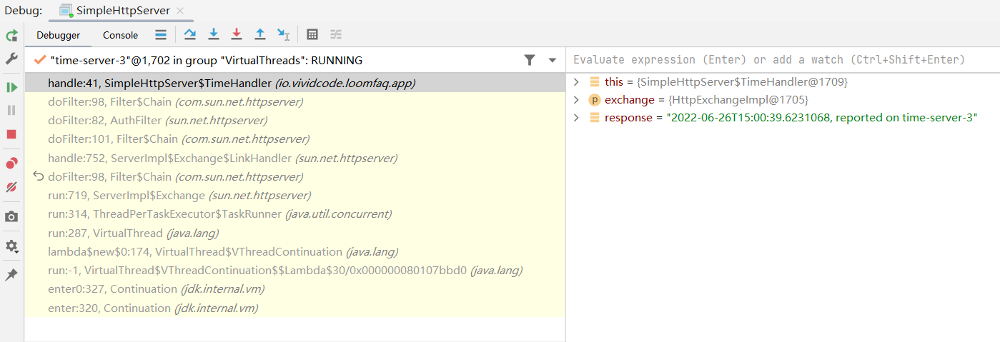
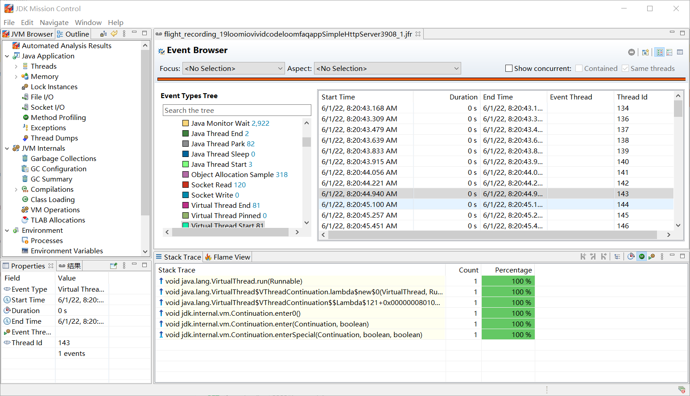
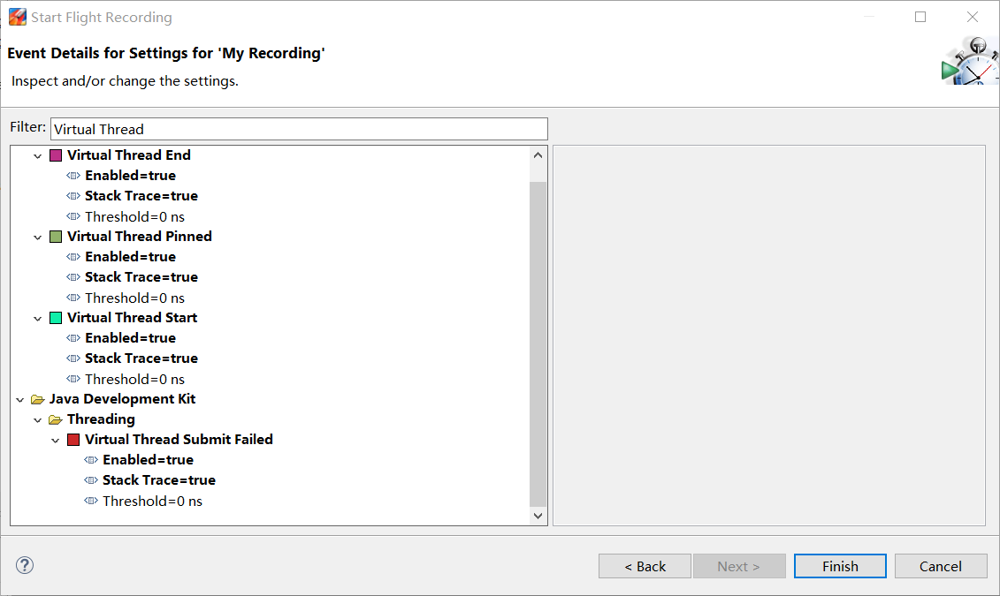

# JDK Project Loom FAQ and Example Code

JDK Project Loom FAQ and example code

[中文版](README_zh_CN.md)

## General

### What's Project Loom?

> **Project Loom** is intended to explore, incubate and deliver Java VM features and APIs built on top of them for the
> purpose of supporting easy-to-use, high-throughput lightweight concurrency and new programming models on the Java
> platform.
>
> [Project Loom Wiki](https://wiki.openjdk.java.net/display/loom/Main)

### How can I use Project Loom?

According to the JDK release process, features in Project Loom will be broken down into several JEPs and made available
in different JDK releases. For JDK 19, the early-access builds can be downloaded from [jdk.java.net](https://jdk.java.net/19/). JDK 19 builds only contain features targeted to JDK 19.

The table below shows a list of targeted features in Project Loom.

| Feature                                                     | Target JDK Release | Status                                        |
| ----------------------------------------------------------- | ------------------ | --------------------------------------------- |
| [Virtual Threads](https://openjdk.java.net/jeps/425)        | 19                 | Preview                                       |
| [Structured Concurrency](https://openjdk.java.net/jeps/428) | 19                 | [Incubator](https://openjdk.java.net/jeps/11) |

In the meantime, you can download Project Loom early-access builds from [Loom website](https://jdk.java.net/loom/).

Features in Project Loom are either in preview or incubating status. To enable preview features, the `--enable-preview`
option needs to be passed to `javac` or `java` command. For incubating features, the corresponding JDK modules need to
be added explicitly. For example, using the option `--add-modules jdk.incubator.concurrent` to enabled the module for
structured concurrency.

## Virtual Thread

### What's virtual thread?

Before Project Loom, there is only one type of threads in Java, which is called *platform thread* in Project Loom.
Platform threads are typically mapped 1:1 to kernel threads scheduled by the operating system. In Project Loom, virtual
threads are introduced as a new type of threads.

Virtual threads are typically *user-mode threads* scheduled by the Java runtime rather than the operating system.
Virtual threads are mapped M:N to kernel threads.

Platform and virtual threads are both represented using `java.lang.Thread`.

### Why we need virtual threads?

The main motivation of using virtual threads is to provide a scalable way to implement *thread-per-request* style
request handling. When writing server applications, it's natural to dedicate one thread to a request to handle it for
its entire duration. This is because requests are independent of each other. This *thread-per-request* style is easy to
understand and program, and also very easy to debug and profile.

However, this `thread-per-request` style cannot be simply implemented using platform threads. Platform threads are
implemented as wrappers around the operating system threads. OS threads are costly, and the number of available threads
is limited. For a server that handles a very large number of requests concurrently, it's not feasible to create a thread
for each request.

### How to create virtual threads?

The first approach to create virtual threads is using the `Thread.ofVirtual` method.

In the code below, a new virtual thread is created and started. The return value is an instance of `java.lang.Thread`
object.

```java
var thread = Thread.ofVirtual().name("my virtual thread")
    .start(() -> System.out.println("I'm running"))
```

The second approach is using `Thread.startVirtualThread(Runnable task)` method. This is the same as
calling `Thread.ofVirtual().start(task)`.

The third approach is using `ThreadFactory`.

```java
var factory = Thread.ofVirtual().factory();
var thread = factory.newThread(() -> System.out.println("Create in factory"));
```

### How to check if a thread is virtual?

The new `isVirtual()` method in `java.lang.Thread` returns `true` is this thread is a virtual thread.

### Does a virtual thread has name?

A virtual thread doesn't have a name by default. The `getName()` method returns the empty string if a thread name is not
set.

The thread name can be set using the `setName()` method, or using the `name` method of `Thread.Builder` returned
from `Thread.ofVirtual()`.

It's recommended to always set a name for debugging and error diagnosis purpose.

### Can virtual threads be non-daemon threads?

No. Virtual threads are always daemon threads. So they cannot prevent JVM from terminating. Calling `setDaemon(false)`
on a virtual thread will throw an `IllegalArgumentException` exception.

### Can the priority of a virtual thread be changed?

No. Virtual threads have a fixed priority of `Thread.NORM_PRIORITY`. The `Thread.setPriority(int)` method has no effect
on virtual threads.

### Can virtual threads support thread-local variables?

Yes. Virtual threads support both thread-local variables (`ThreadLocal`) and inheritable thread-local
variables (`InheritableThreadLocal`).

### Can thread local variables be disabled for virtual threads?

Yes. If no thread-local variables are required, the support can be disabled using methods in `Thread.Builder`.

To disable thread-local variables, we can use the `allowSetThreadLocals(boolean allow)` method.

When thread-local variables are not allowed:

* Using the `ThreadLocal.set(Object)` method to set a value for a thread-local variable will
  throw `UnsupportedOperationException`.
* The`ThreadLocal.get()` method always returns the initial value.

In the code below, calling `threadLocal.set(100)` throws `UnsupportedOperationException`.

```java
ThreadLocal<Integer> threadLocal = new ThreadLocal<>();
Thread.ofVirtual()
  .allowSetThreadLocals(false)
  .start(() -> threadLocal.set(100)) // throws UnsupportedOperationException
  .join();
```

In the code below, the initial value `1` of the thread-local variable is printed out.

```java
ThreadLocal<Integer> threadLocal = ThreadLocal.withInitial(() -> 1);
Thread.ofVirtual()
  .allowSetThreadLocals(false)
  .start(() -> System.out.println(threadLocal.get())) // The output is "1"
  .join();
```

To not inherit the values of inheritable thread-local variables, you can use
the `inheritInheritableThreadLocals(boolean inherit)` method.

In the code below, the `InheritableThreadLocal` object has its value set to `300` in the parent thread. However, the
child thread disabled inheritance of inheritable thread-local variables, the `InheritableThreadLocal`object has the
value `null` in the child thread.

```java
var inheritableThreadLocal = new InheritableThreadLocal<Integer>();
Thread.ofVirtual()
  .name("parent")
  .start(() -> {
    inheritableThreadLocal.set(300);
    Thread.ofVirtual()
      .name("child")
       .inheritInheritableThreadLocals(false)
        .start(() -> System.out.println(inheritableThreadLocal.get())); // The output is "null"
  }).join();
```

### Should virtual threads be pooled?

No. Virtual threads are light-weight. There is no need to pool them.

Sometimes a thread pool is used to limit concurrent access to a limited resource. For example, if the upstream server
can only handle a limit to 10 concurrent requests, a thread pool with maximum 10 threads may be used to enforce the
limitation. However, this pattern shouldn't be used for virtual threads. Structs like `Semaphore` should be used to
guard access to a limited resource.

### How are virtual threads scheduled?

Virtual threads are scheduled by the JDK. JDK assigns virtual threads to platform threads, then those platform threads
are scheduled by the operating system.

The platform thread which a virtual thread is assigned to is called the virtual thread's `carrier`. A virtual thread may
be scheduled to multiple carriers during its lifetime. The identity of the carrier is unavailable to the virtual thread.

JDK scheduler for virtual threads is a work-stealing `ForkJoinPool` working in FIFO mode. The number of platform threads used for scheduling is determined by the `parallelism`  of this `ForkJoinPool`. The default thread number is the same as CPU processors, which is retrieved by calling `Runtime.availableProcessors()`. The thread number can also be set via system property `jdk.virtualThreadScheduler.parallelism`.

### How are virtual threads executed?

When executing code in virtual threads, JDK scheduler assigns the virtual thread to a platform thread. This is called mounting a virtual thread on a platform thread. The selected platform thread becomes the carrier of this virtual thread. After executing some code, the virtual thread may unmount from the platform thread.

When the virtual thread is blocking on I/O or other blocking operations, it can be unmounted from the platform thread. When the blocking operation is finished, the virtual thread can be mounted to another platform thread for execution. Mounting and unmounting of virtual threads are transparent to code executed in virtual threads.

Some blocking operations in the JDK do not unmount the virtual thread, and thus block both its carrier and the underlying OS thread. This is because of limitations either at the OS level or at the JDK level. To compensate  for the capture of the OS thread, the parallelism of the scheduler will be temporarily expanded. This means that the number of platform threads in the scheduler's `ForkJoinPool` may temporarily exceed the configured value. The maximum number of platform threads available to the scheduler can be configured with the system property `jdk.virtualThreadScheduler.maxPoolSize`. 

There are two scenarios in which a virtual thread will be pinned to its carrier and cannot be unmounted during blocking operations:

* When it executes code inside a `synchronized` method or block,
* When it executes a `native` method or a foreign function.

Pinning may hinder an application's scalability. It a virtual thread performs a blocking operation while it's pinned, then  its carrier and the underlying OS thread are blocked for the duration of the operation. The scheduler doesn't compensate for pinning by expanding its parallelism. To avoid frequent and long-lived pinning, `synchronized` blocks or methods that run frequently and guard long I/O operations should be replaced with `java.util.concurrent.locks.ReentrantLock`.


## `ExecutorService`

### Can `ExecutorService` use virtual threads?

An `ExecutorService` can start a virtual thread for each task. This kind of `ExecutorService`s can be created
using `Executors.newVirtualThreadPerTaskExecutor()` or `Executors.newThreadPerTaskExecutor(ThreadFactory threadFactory)`
methods. The number of virtual threads created by the `Executor` is unbounded.

In the code below, a new `ExecutorService` is created to use virtual threads. 10000 tasks are submitted to
this `ExecutorService`.

```java
try (var executor = Executors.newVirtualThreadPerTaskExecutor()) {
  IntStream.range(0, 10_000).forEach(i -> executor.submit(() -> {
    Thread.sleep(Duration.ofSeconds(1));
    return i;
  }));
}
```

## `Future`

### What are changes to `Future` in Loom?

A new enum `Future.State` is added to represent the state of a `Future`.

| Enum value | Description |
| ------ | ---- |
| `CANCELLED` |   The task was cancelled.   |
|  `FAILED`      |   The task completed with an exception.   |
|   `RUNNING`     |  The task has not completed.    |
|   `SUCCESS`     |   The task completed with a result.   |

The `state()` method of `Future` can retrieve the state of a `Future`.

The methods `resultNow()` and `exceptionNow()` can get the result or exception of a  `Future` without waiting, respectively.

## Debugging

### How to debug virtual threads?

Virtual threads are instances of `java.lang.Thread`. Existing tools to debug, profile, and monitor threads can still work with virtual threads. Java debuggers can step through virtual threads, show call stacks, and inspect variables in stack frames.

The screen-shot below shows debugging a virtual thread in IntelliJ IDEA.



### How to view thread dump of a virtual thread?

The thread dump plays an important role in troubleshooting applications. JDK's traditional thread dump presents a flat list of threads. This is unsuitable for thousands or millions of virtual threads. The traditional thread dump format is extended to include virtual threads. A new kind of thread dump is introduced to present virtual threads.

To get a thread dump, the process id should be obtained first. This can be done using the `jps` command.

After obtaining the process id, use `jcmd` command to get a thread dump. To visualize and analyze a great number of virtual threads, `jcmd` can emit the new thread dump in JSON format.

```sh
$ jcmd <pid> Thread.dump_to_file -format=json <file>
```

See [here](./assets/thread-dump.json) for an example of thread dump JSON file.

### How to use JFR to view virtual threads events?

JDK Flight Recorder (JRF) adds events related to virtual threads.


| Event                           | Description                                    | Enabled by default |
| ------------------------------- | ---------------------------------------------- | ------------------ |
| `jdk.VirtualThreadStart`        | A virtual thread starts.                       | No                 |
| `jdk.VirtualThreadEnd`          | A virtual thread ends.                         | No                 |
| `jdk.VirtualThreadPinned`       | A virtual thread was parked while pinning.     | Yes                |
| `jdk.VirtualThreadSubmitFailed` | Starting or unparking a virtual thread failed. | Yes                |

The screen-shot below shows virtual threads events in JFR.



Events for virtual threads starting and ending need to be enabled explicitly.



## Structured Concurrency

### What's structured concurrency?

Structured concurrency is a coined [term](https://250bpm.com/blog:71/). It's described in details in this [post](https://vorpus.org/blog/notes-on-structured-concurrency-or-go-statement-considered-harmful/). The key point of structured concurrency is `structured`. Structured means the structure of concurrent tasks should match the code structure. By leveraging structured concurrency, developers can write concurrent programs just like single-threaded programs. All the heavy-lifting jobs are done by the underlying framework.

> [Kotin Coroutines](https://kotlinlang.org/docs/coroutines-overview.html) is a greate example of using [structured concurrency](https://kotlinlang.org/docs/coroutines-basics.html#structured-concurrency). New coroutines can be only launched in a specific `CoroutineScope` which delimits the lifetime of the coroutine. 

Considering that we are creating an API to expose a user's information in an e-commerce application. When using microservice architecture, a user's information may be maintained by different services. We may need to fetch data from multiple sources and assemble them to get the final result.

The code below shows a simple method `getUser()` to load and assemble a user's information. It fetches data from three different sources. We can treat the `getUser()` method as a task, while those three methods `fetchUserBasicInfo`, `fetchFavoriteStores` and `fetchOrders` are subtasks of the main task.

```java
public UserData getUser(String userId) {
    UserBasicInfo basicInfo = fetchUserBasicInfo(userId);
    List<Store> favoriteStores = fetchFavoriteStores(userId);
    List<Order> orders = fetchOrders(userId);
    return assemble(basicInfo, favoriteStores, orders);
}
```

Apparently, there is a dependency between the main task and subtasks.

* The main task can only complete when all the subtasks complete.
* If any of the subtask failed, the main task will also fail. All other ongoing subtasks should be cancelled, because there results won't be used.

If all subtasks are executed synchronously in a single thread, then we can easily get the following assumptions:

* If `fetchUserBasicInfo` fails, both `fetchFavoriteStores` and `fetchOrders` won't be executed, `getUser` returns immediately.
* `getUser` completes after `assemble` completes, `fetchUserBasicInfo`, `fetchFavoriteStores` and `fetchOrders` all completes successfully before that.

These assumptions can be easily derived from the code structure of `getUser` method. Those three methods are contained in the block of `getUser` method, so their life time is confined by the outer method.

If subtasks are executed asynchronously in different threads, then we cannot make the same assumption.

* Even `getUser` returns, all the subtasks may still be running in their own threads.
* If `fetchUserBasicInfo` fails, other two subtasks may still run to their ends.

It's possible to implement `getUser` correctly with multithreading support in Java, including `Executor`s and thread pools. However, it's not an easy task, even for most-experienced developers. You have to deal with `Executors`, thread pools, thread interruption, timeout, cooperative cancellation,  graceful shutdown. 

With structured concurrency, we can simply treat concurrent subtasks as they are running in a single thread. Those assumptions still hold. This makes concurrent programming much easier.

### How to use structured concurrency?

The main API to use structured concurrency is `jdk.incubator.concurrent.StructuredTaskScope`. A `StructuredTaskScope` object is a scope where subtasks are executed in.  The workflow of using `StructuredTaskScope` is as follows:

1. The main task creates a `StructuredTaskScope` object.
2. Use the `fork()` method to create a new subtask.
3. Calls the `join()` or `joinUntil()` method to wait for subtasks to complete or be cancelled.
4. After joining, handle any errors in the subtasks and process their results.
5. Close the scope, usually implicitly via `try`-with-resources. 
6. During the tasks execution, calling the `shutdown()` method to request cancellation of all remaining subtasks.

The thread that creates a `StructuredTaskScope` object is the *owner* of the scope.

The table below shows methods of `StructuredTaskScope`.

| Method                                                     | Description                                    |
| ---------------------------------------------------------- | ---------------------------------------- |
| `<U extends T> Future<U> fork(Callable<? extends U> task)` | Starts a new thread to run the given task.                   |
| `StructuredTaskScope<T> join()`                            | Wait for all threads to finish or the task scope to shut down.  |
| `StructuredTaskScope<T> joinUntil(Instant deadline)`       | Wait for all threads to finish or the task scope to shut down, up to the given deadline.    |
| `shutdown()`                                               | Shut down the task scope without closing it.                            |
| `close()`                                                  | Closes this task scope.                          |

There are two types of `StructuredTaskScope` subclasses that are commonly used, `StructuredTaskScope.ShutdownOnFailure`  and `StructuredTaskScope.ShutdownOnSuccess`.

* `ShutdownOnFailure` captures the exception of the first subtask to complete abnormally. The policy implemented by this class is intended for cases where the results for all subtasks are required ("invoke all"); if any subtask fails then the results of other unfinished subtasks are no longer needed.

* `ShutdownOnSuccess` captures the result of the first subtask to complete successfully. The policy implemented by this class is intended for cases where the result of any subtask will do ("invoke any") and where the results of other unfinished subtask are no longer needed.

The following code shows an example of using `StructuredTaskScope.ShutdownOnFailure`. The main task is `calculate` method. It creates a `ShutdownOnFailure` object, then it forks a subtask that calls the `op1` method. The `calculateInner` method creates another `ShutdownOnFailure` object which forks two subtasks to call the `op21` and `op22` methods.  The `join` method waits for the subtasks to complete. The `throwIfFailed` method throws if a task completes abnormally. The `fork` method returns a `Future` object. After `join` method returns, we can be sure that the `Future` object completes, so it's safe to call `resultNow` to get the actual value.

```java
public class StructuredCurrencyExample {

  public static void main(String[] args) throws Exception {
    System.out.println(
        Helper.timed(() -> new StructuredCurrencyExample().calculate()));
  }

  public int calculate() throws InterruptedException, ExecutionException {
    try (var scope = new StructuredTaskScope.ShutdownOnFailure()) {
      Future<Integer> v1 = scope.fork(this::op1);
      int v2 = calculateInner();
      scope.join();
      scope.throwIfFailed();
      return v1.resultNow() * v2;
    }
  }

  private int calculateInner() throws InterruptedException, ExecutionException {
    try (var scope = new StructuredTaskScope.ShutdownOnFailure()) {
      Future<Integer> v21 = scope.fork(this::op21);
      Future<Integer> v22 = scope.fork(this::op22);
      scope.join();
      scope.throwIfFailed();
      return v21.resultNow() + v22.resultNow();
    }
  }

  private int op1() {
    System.out.println("Operation 1 starts");
    try {
      Thread.sleep(Duration.ofSeconds(3));
    } catch (InterruptedException e) {
      // ignored
    }
    System.out.println("Operation 1 finishes");
    return 1;
  }

  private int op21() {
    System.out.println("Operation 2.1 starts");
    try {
      Thread.sleep(Duration.ofSeconds(4));
    } catch (InterruptedException e) {
      // ignored
    }
    System.out.println("Operation 2.1 finishes");
    return 3;
  }

  private int op22() {
    System.out.println("Operation 2.2 starts");
    try {
      Thread.sleep(Duration.ofSeconds(2));
    } catch (InterruptedException e) {
      // ignored
    }
    System.out.println("Operation 2.2 finishes");
    return 3;
  }
}
```

The code above demonstrates a task tree. The chart below shows the task tree. The parent task supervises subtasks in the children nodes.

```
       calculate
     /           \
    op1      calculateInner
            /           \
          op21          op22
```

### How to perform *invokeAll* actions using structured concurrency?

 `StructuredTaskScope.ShutdownOnFailure` can be used to perform *invokeAll* actions.

The code below shows an example of using `ShutdownOnFailure`. In the `invokeAll` method, `10000` tasks are created to return an integer, then all these integers are summed  up.

```java
public class InvokeAll {

  public static void main(String[] args) throws Exception {
    System.out.println(Helper.timed(() -> new InvokeAll().invokeAll()));
  }

  public long invokeAll() throws InterruptedException, ExecutionException {
    try (var scope = new StructuredTaskScope.ShutdownOnFailure()) {
      var futures = subTasks().map(scope::fork).toList();
      scope.join();
      scope.throwIfFailed();
      return futures.stream().map(Future::resultNow).reduce(0, Integer::sum);
    }
  }

  private Stream<Callable<Integer>> subTasks() {
    return IntStream.range(0, 10_000)
        .mapToObj(
            i ->
                () -> {
                  try {
                    Thread.sleep(Duration.ofSeconds(ThreadLocalRandom.current().nextLong(3)));
                  } catch (InterruptedException e) {
                    // ignore
                  }
                  return i;
                });
  }
}
```

### How to perform *invokeAny* actions using structured concurrency?

`StructuredTaskScope.ShutdownOnSuccess` can be used to perform *invokeAny* actions.

The code below shows an example of using `ShutdownOnSuccess`. This example is similar with the *InvokeAll* code. It starts `1000` tasks and returns the number of tasks that actually succeeded. When running the program, we can see that the number of succeeded tasks varies. Usually there will be hundreds of completed tasks. This is because it takes time to cancel tasks.

```java
public class InvokeAny {

  public static void main(String[] args) throws Exception {
    System.out.println(Helper.timed(() -> new InvokeAny().invokeAny()));
  }

  public long invokeAny() throws InterruptedException {
    try (var scope = new StructuredTaskScope.ShutdownOnSuccess<>()) {
      var futures = subTasks().map(scope::fork).toList();
      scope.join();
      return futures.stream().filter(f -> !f.isCancelled()).count();
    }
  }

  private Stream<Callable<Integer>> subTasks() {
    return IntStream.range(0, 1000)
        .mapToObj(
            i ->
                () -> {
                  try {
                    Thread.sleep(Duration.ofSeconds(1 + ThreadLocalRandom.current().nextLong(5)));
                  } catch (InterruptedException e) {
                    // ignore
                  }
                  return i;
                });
  }
}
```

### What's the difference between `shutdown` and `close` of `StructuredTaskScope`?

The `shutdown` method of `StructuredTaskScope` will:

* Prevent new threads from starting.
* Cancel tasks that have threads waiting on a result so that the waiting threads wakeup.
* Interrupts all unfinished threads in the scope.
* Wakes up the owner if it is waiting in `join` or `joinUntil`. If the owner is not waiting then its next call to `join` or `joinUntil` will return immediately.

When `shutdown` completes,  the `Future` objects for all tasks will be done, normally or abnormally.

The `shutdown` method may only be invoked by the task scope owner or threads contained in the task scope.

The `close` method calls the `shutdown` method to shut down the scope first. It then waits for the threads executing any unfinished tasks to finish.  The `close` method is usually called implicitly using `try-with-resources`.

The `close` method may only be invoked by the task scope owner.

## JDK Libraries

### How virtual threads are used in JDK libraries?

JDK libraries have been upgraded to use virtual threads, especially server-side components.

The code below shows a simple HTTP server using `com.sun.net.httpserver.HttpServer`. It uses virtual threads to handle requests. `Executors.newThreadPerTaskExecutor(Thread.ofVirtual().name("time-server-", 1).factory())` creates an `Executor` that creates virtual threads for each task.

```java
import com.sun.net.httpserver.HttpExchange;
import com.sun.net.httpserver.HttpHandler;
import com.sun.net.httpserver.HttpServer;
import java.io.IOException;
import java.net.InetSocketAddress;
import java.time.LocalDateTime;
import java.time.format.DateTimeFormatter;
import java.util.concurrent.Executors;

public class SimpleHttpServer {

  public static void main(String[] args) throws IOException {
    new SimpleHttpServer().start();
  }

  public void start() throws IOException {
    var server = HttpServer.create(new InetSocketAddress(8000), 0);
    server.createContext("/time", new TimeHandler());
    server.setExecutor(
        Executors.newThreadPerTaskExecutor(Thread.ofVirtual().name("time-server-", 1).factory()));
    server.start();
    System.out.println("Time server started");
  }

  private static class TimeHandler implements HttpHandler {

    @Override
    public void handle(HttpExchange exchange) throws IOException {
      var response =
          String.format(
              "%s, reported on %s",
              LocalDateTime.now().format(DateTimeFormatter.ISO_LOCAL_DATE_TIME),
              Thread.currentThread().getName());
      exchange.sendResponseHeaders(200, response.length());
      try (var out = exchange.getResponseBody()) {
        out.write(response.getBytes());
      }
    }
  }
}
```

