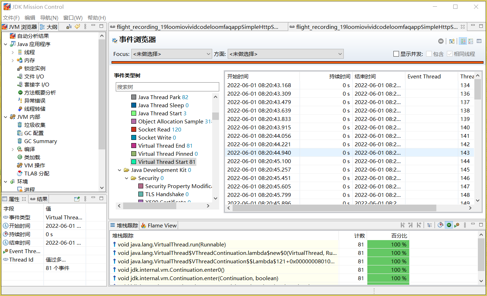

# JDK Loom 项目 FAQ

## 概述

### 什么是 Loom 项目？

> **Project Loom** is to intended to explore, incubate and deliver Java VM features and APIs built on top of them for the purpose of supporting easy-to-use, high-throughput lightweight concurrency and new programming models on the Java platform. 
>
> [Project Loom Wiki](https://wiki.openjdk.java.net/display/loom/Main)


### 我该如何使用 Loom 项目？

 根据 JDK 的发布周期，Loom 项目中的功能会被划分成多个 JEP，并添加到不同的 JDK 发布版本中。

| 功能                                                        | 目标 JDK 版本 | 状态                                        |
| ----------------------------------------------------------- | ------------------ | --------------------------------------------- |
| [虚拟线程](https://openjdk.java.net/jeps/425)        | 19                 | 预览                                       |
| [结构化并发](https://openjdk.java.net/jeps/428) | 19                 | [孵化](https://openjdk.java.net/jeps/11) |

与此同时，你可以从  [Loom项目网站](https://jdk.java.net/loom/) 下载 Loom 项目的早期预览版。

Loom 项目中的功能目前仍然是预览或孵化状态。为了启用预览功能，`javac` 和 `java` 命令需要添加 `--enable-preview`  选项。对于孵化功能，对应的 JDK 模块需要被显式地添加。比如，使用选项 `--add-modules jdk.incubator.concurrent`  可以启用结构化并发模块。

## 虚拟线程

### 什么是虚拟线程？

在 Loom 项目之前，Java 中只有一种类型的线程，在 Loom 项目中称为 *平台线程*。平台线程与内核线程是一一对应的。在 Loom 项目中引入了一种新的线程类型 - 虚拟线程。

虚拟线程是*用户模式线程*，由 Java 运行时进行调动，而不是由操作系统来调度。虚拟线程和内核线程是 M 对 N 的对应关系，也就是说， M 个虚拟线程会被映射到 N 个内核线程上。

平台线程和虚拟线程都使用 `java.lang.Thread` 来表示。

### 为什么需要虚拟线程？

使用虚拟线程的重要动机是提供一种可扩展的方式来实现 *thread-per-request* 的并发风格。在编写服务端应用时，最自然的方式是对于每个请求，使用独有的线程来处理该请求，因为请求是相互独立的。这就是 *thread-per-request* 的并发风格。这种方式易于理解和编程实现，也易于调试和性能调优。

然而，*thread-per-request* 风格并不能简单地使用平台线程来实现。在实现上，平台线程是操作系统上线程的封装。操作系统的线程会占用资源，存在数量上限。对于一个要并行处理海量请求的服务器应用来说，对每个请求都创建一个平台线程是不可能的。

对于这个现实的问题，有很多框架提供了解决方案。常用的思路是依赖非阻塞 I/O 和异步编程。当某个请求在等待 I/O 操作时，它会暂时让出线程，并在 I/O 操作完成之后继续。通过这种方式，可以用少量的线程来同时处理大量的请求。这些框架可以提升系统的吞吐量，但是要求开发人员必须熟悉所使用的底层框架，并按照特定的风格来编写代码。

在使用虚拟线程之后，开发人员可以使用最自然的方式来编写代码，把请求的处理逻辑全部在一个虚拟线程中完成。在完成对请求的处理之后，相应的线程也会被自动销毁。这极大地降低了编写高并发服务端应用的难度。

### 如何创建虚拟线程？

创建虚拟线程的第一种方式是使用 `Thread.ofVirtual` 方法。

在下面的代码中，一个新的虚拟线程被创建并启动。返回值是`java.lang.Thread`的对象实现。

```java
var thread = Thread.ofVirtual().name("my virtual thread")
    .start(() -> System.out.println("I'm running"))
```

第二种方式是使用 `Thread.startVirtualThread(Runnable task)` 方法。这个方法等同于 `Thread.ofVirtual().start(task)`。

第三种方式是使用 `ThreadFactory`，如下面的代码所示。

```java
var factory = Thread.ofVirtual().factory();
var thread = factory.newThread(() -> System.out.println("Create in factory"));
```

### 如何判断一个线程是否是虚拟的？

`java.lang.Thread` 的新方法 `isVirtual` 可以判断当前线程是否是虚拟的。

### 虚拟线程是否有名字？

虚拟线程默认是没有名字的。当没有设置名字时，`getName` 方法会返回空字符串。

线程的名字可以使用 `setName` 方法来设置，或者使用 `Thread.ofVirtual` 返回的 `Thread.Builder` 对象的 `name` 方法。

推荐的做法是为虚拟线程设置名称，以方便调试。

### 虚拟线程是否可以是非 daemon 线程？

不可以。虚拟线程永远是 daemon 线程，因此它们无法阻止 JVM 退出。在一个虚拟线程的 `Thread` 对象上调用 `setDaemon(false)` 方法会抛出 `IllegalArgumentException` 异常。

### 是否可以改变虚拟线程的优先级？

不可以。虚拟线程有一个固定的优先级 `Thread.NORM_PRIORITY`。方法 `Thread.setPriority(int)` 对虚拟线程不起作用。

### 虚拟线程是否支持 thread-local 变量？

是。虚拟线程支持 thread-local 变量（`ThreadLocal`）和可继承的 thread-local 变量（`InheritableThreadLocal`）。

### 虚拟线程是否可以禁用 thread-local 变量？

可以。如果不需要使用 thread-local 变量，可以通过 `Thread.Builder` 中的方法来禁用。

如果需要禁用 thread-local 变量，可以使用 `allowSetThreadLocals(boolean allow)` 方法。

如果 thread-local 变量被禁用：

* 使用 `ThreadLocal.set(Object)` 方法来设置一个 thread-local 变量的值时，会抛出 `UnsupportedOperationException` 异常。
* `ThreadLocal.get()` 方法总是返回初始值。

在下面的代码中，调用 `threadLocal.set(100)` 会抛出 `UnsupportedOperationException`。

```java
ThreadLocal<Integer> threadLocal = new ThreadLocal<>();
Thread.ofVirtual()
  .allowSetThreadLocals(false)
  .start(() -> threadLocal.set(100)) // 抛出 UnsupportedOperationException
  .join();
```

在下面的代码中，thread-local 变量的初始值 `1` 会被输出。

```java
ThreadLocal<Integer> threadLocal = ThreadLocal.withInitial(() -> 1);
Thread.ofVirtual()
  .allowSetThreadLocals(false)
  .start(() -> System.out.println(threadLocal.get())) // 输出是 "1"
  .join();
```

如果不希望可继承的 thread-local 变量从父线程继承值，可以使用  `inheritInheritableThreadLocals(boolean inherit)` 方法。

在下面的代码中，`InheritableThreadLocal` 对象的值在父线程中被设置为 `300`，而子线程禁止了可继承的 thread-local 变量的继承，因此在子线程中，`InheritableThreadLocal` 对象的值是 `null`。

```java
var inheritableThreadLocal = new InheritableThreadLocal<Integer>();
Thread.ofVirtual()
  .name("parent")
  .start(() -> {
     inheritableThreadLocal.set(300);
     Thread.ofVirtual()
        .name("child")
        .inheritInheritableThreadLocals(false)
        .start(() -> System.out.println(inheritableThreadLocal.get())); // 输出是 "null"
  }).join();
```

### 虚拟线程是否应该放入线程池中？

虚拟线程是轻量级的，并不需要放入线程池中，在需要的时候创建即可。

在有些情况下，线程池被用来限制对受限资源的访问。比如，一个上游服务器只能处理 10 个并发请求。一种做法是创建一个大小为 10 的线程池，在该线程池中执行访问请求。这种模式并不适用于虚拟线程。应该使用 `Semaphore` 这样的并发结构来限制对资源的访问。

### 虚拟线程是如何调度的？

虚拟线程由 JDK 负责调度。JDK 把虚拟线程分配给平台线程，平台线程由操作系统进行调度。

一个虚拟线程所分配的平台线程被称为该虚拟线程的*载体*。在整个生命周期过程中，一个虚拟线程可能就会被调度到多个载体上。载体的标识对于虚拟线程是不可见的。

JDK 的虚拟线程调度是一个以 FIFO 模式工作的 work-stealing `ForkJoinPool`。该 `ForkJoinPool` 的 `parallelism` 决定了调度时可以使用的平台线程的数量。该数量默认等于处理器的数量（通过 `Runtime.availableProcessors()`获取），也可以通过系统属性 `jdk.virtualThreadScheduler.parallelism`来设置。

### 虚拟线程如何执行代码？

在执行虚拟线程的代码时，JDK 的线程调度器把虚拟线程分配到一个平台线程上执行。这个过程称为把虚拟线程绑定（mount）到平台线程。这个平台线程就成为了该虚拟线程的载体。在执行了某些代码之后，该虚拟线程可以从平台线程解除绑定（unmount）。

当虚拟线程在等待 I/O 或是执行某些阻塞操作时，可以从平台线程上解除绑定。等阻塞操作完成之后，该虚拟线程可以被调度到新的平台线程上继续执行。虚拟线程的绑定和解除绑定操作，对于应用代码来说是透明的。

有些 JDK 中的阻塞操作并不会解除对平台线程的绑定，因此会阻塞平台线程和底层的 OS 线程。这是由于操作系统或 JDK 自身的限制，比如很多文件操作以及 `Object.wait()` 方法调用。这些阻塞操作的实现会在内部对此进行补偿。具体的做法是临时增加调度器可以使用的线程数量。因此，JDK 调度器的 `ForkJoinPool` 中的线程数量可能会超过 `parallelism` 指定的值。可以使用系统属性 `jdk.virtualThreadScheduler.maxPoolSize` 来指定调度器中线程的最大值。

在两种情况下，虚拟线程在执行阻塞操作时，会被锁定（pin）在载体上而无法解除绑定：

* 在执行 `synchronized` 方法或块时
* 在执行 `native` 方法或外部方法时

虚拟线程的锁定可能会对应用的可伸缩性产生影响。当锁定发生时，调度器并不会对此进行补偿。为了避免经常出现的较长时间的锁定，考虑把 `synchronized` 方法或块替换成 `java.util.concurrent.locks.ReentrantLock`。

### 如何调试虚拟线程相关的问题？

虚拟线程同样是 `java.lang.Thread` 的实例，因此已有的调试工具仍然可以继续工作。在进行调试时，可以用同样的方式来逐步执行，查看调用栈，以及检查变量的值。


## `ExecutorService`

### `ExecutorService` 是否可以使用虚拟线程？

`ExecutorService` 可以为每个任务启动一个虚拟线程。这一类的 `ExecutorService` 对象可以使用 `Executors.newVirtualThreadPerTaskExecutor()` 或 `Executors.newThreadPerTaskExecutor(ThreadFactory threadFactory)` 方法来创建。这一类 `Executor` 对象所能创建的线程数量是无限的。

在下面的代码中，创建了一个使用虚拟线程的 `ExecutorService` 对象，并向该 `ExecutorService` 提交了10000个任务。每个任务会休眠 1 秒钟。

```java
try (var executor = Executors.newVirtualThreadPerTaskExecutor()) {
  IntStream.range(0, 10_000).forEach(i -> executor.submit(() -> {
    Thread.sleep(Duration.ofSeconds(1));
    return i;
  }));
}
```


## `Future`

## 结构化并发

### 什么是结构化并发？

## 调试

### 如何查看虚拟线程的 thread dump？

在故障排查中，thread dump 发挥着重要的作用。由于虚拟线程的数量较大，传统的以扁平列表的方式在 thread dump 中显示线程的方式，对于虚拟线程不太适用。Loom 项目增加了一种使用 JSON 格式的 thread dump，可以更好的展示虚拟线程之间的关系，也方便工具进行处理。

首先可以使用 `jps` 命令列出了全部的 JVM 进程 ID，再使用 `jcmd` 命令来生成 thread dump。

```sh
$ jcmd <pid> Thread.dump_to_file -format=json <file>
```

### 如何使用 JFR 来查看虚拟线程相关的事件？

JDK Flight Recorder（JFR）增加了与虚拟线程相关的事件。

| 事件                            | 说明             | 是否默认启用 |
| ------------------------------- | ---------------- | ------------ |
| `jdk.VirtualThreadStart`        | 虚拟线程启动     | 否           |
| `jdk.VirtualThreadEnd`          | 虚拟线程结束     | 否           |
| `jdk.VirtualThreadPinned`       | 虚拟线程被锁定   | 是           |
| `jdk.VirtualThreadSubmitFailed` | 虚拟线程启动失败 | 是           |

下面的图片展示了 JFR 中与虚拟线程相关的事件。值得注意的是，虚拟线程启动和结束的事件需要在收集时显式地启用。


